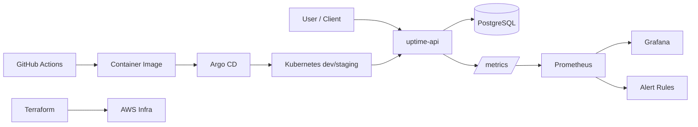

# Architecture

## Scope

URL Uptime Monitor platform with GitOps deployment and production-style operations.

## High-Level Components

- `uptime-api` (Go): API + scheduler + checker + Prometheus metrics
- `PostgreSQL`: target definitions and check history
- `Prometheus`: scrape metrics, evaluate alerts
- `Grafana`: operational dashboards
- `Argo CD`: GitOps deployment controller
- `Terraform`: infrastructure provisioning
- `GitHub Actions`: CI/image release automation

## Architecture Diagram

## Runtime Data Flow

1. User creates a target URL via API.
2. Scheduler enqueues/checks targets at configured intervals.
3. Checker performs HTTP request and records result.
4. Result is written to PostgreSQL and reflected in metrics.
5. Prometheus evaluates SLI/SLO rules.
6. Alerts and dashboards drive operational response.

## Environments

- `dev`: fast iteration and validation
- `staging`: release candidate verification

## Reliability Model (target for later phases)

- liveness and readiness probes
- horizontal scaling of API/checker workers
- retry with timeout boundaries
- alerting on failure ratio and high latency
